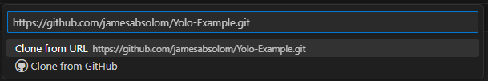
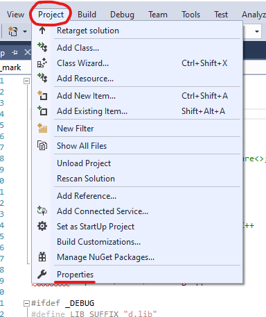
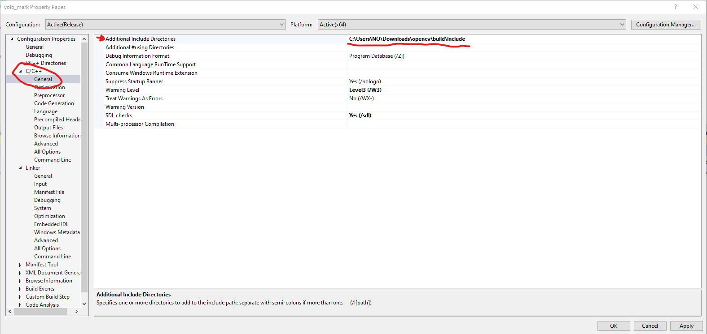
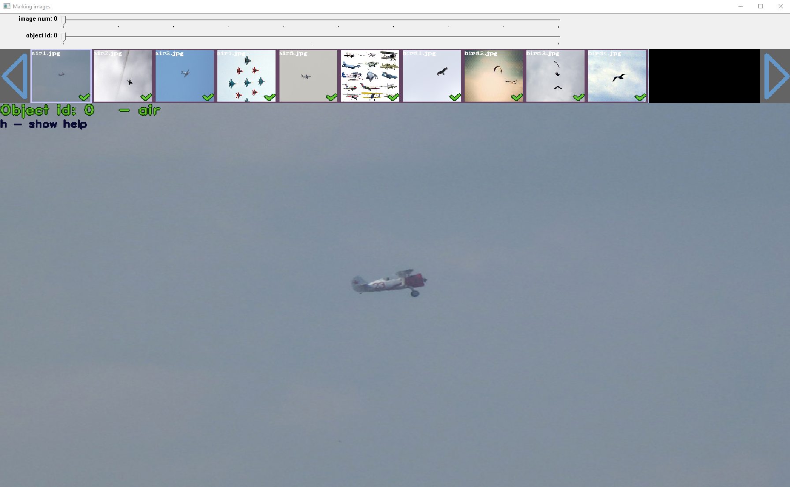
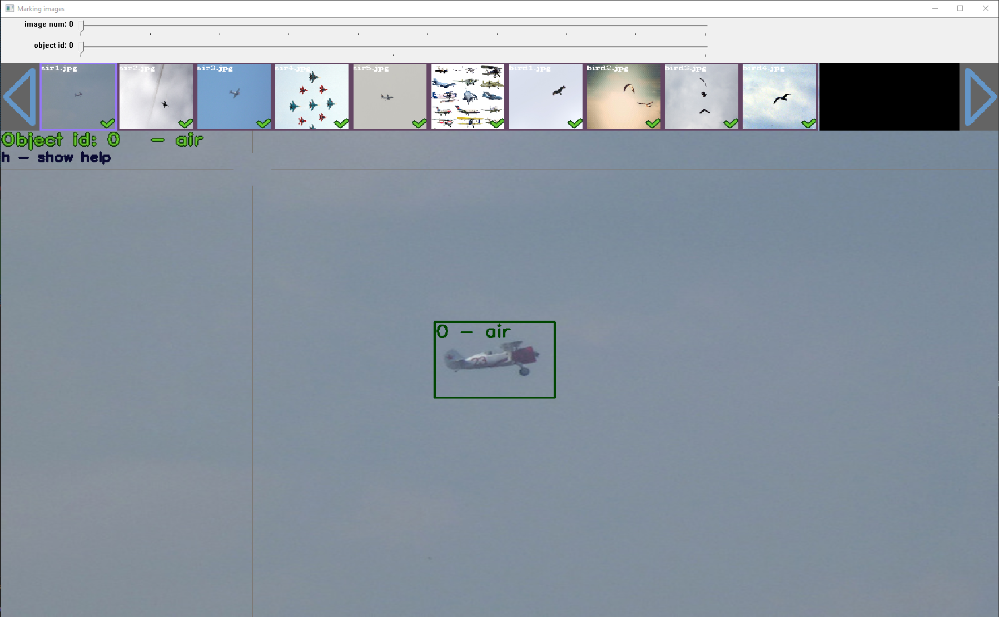
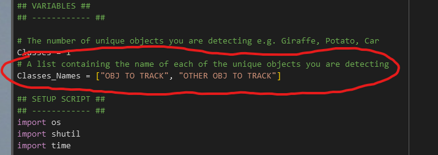

<h1>Instructions:</h1>

<h2>Setup:</h2>

In this stage we are going to:
<ol>
    <li> <b> Download the repo for this project (Note: I will use VScode source control for this) </b> </li>
    <li> <b> Download the submodules for this project </b> </li>
    <li> <b> Install the necisary python version for this project </b> </li>
    <li> <b> Install the necisary python packages for this project </b> </li>
    <li> <b> Install visual studio 2015 so we can compile the marking software </b> </li>
    <li> <b> Download opencv build files so we can compile the marking software </b> </li>
</ol>

<h3> Step 1 </h3>
To use the code in this repo you will need to download it, to do this you will need to use VScode source control, to do this follow these steps:

<ol>
    <li> On this repo click the green code button then the copy repo link button, pictured here: </li>
    
    <li> Open VScode then click on the source control tab on the left hand side, then click the clone repo button, pictured here: </li>
    
    <li> Paste the link you copied from the github repo into the box at the top of the screen and click enter, then select a folder to clone the repo into (I reccomend documents as its easy to find), it should look like this: </li>
    
    <li> VScode should then ask if you want to open the cloned repo, click yes </li>
</ol>

<h3> Step 2 </h3>
Submodules are other github repos which are used in this project, some I have made myself and some are from other people, to download them follow these steps:

<ol>
    <li> Open the terminal in VScode by clicking the terminal tab at the top of the screen then clicking new terminal </li>
    <li> In the terminal type the following command:  
    <code> git submodule update --init --recursive </code>  
    This will download all the submodules for this project </li>
</ol>

<h3> Step 3 </h3>
To run the code in this repo you will need to install python 3.10.9 (though other versions of python may work?), to do this follow these steps:

<ol>
    <li> Go to the python 3.10.9 link <a href="https://www.python.org/downloads/release/python-3109/"> here </a> </li>
    <li> Download the necisary installer for your operating system (this will be located in a table at the bottom of the page)</li>
    <li> Run the installer and follow the instructions, note for windows you will want to check the box which says "add python to path" and also "add python to environment variables" </li>
    <li> Once the installer is finished, open the terminal in VScode by clicking the terminal tab at the top of the screen then clicking new terminal </li>
    <li> In the terminal type the following command:  
    <code> python --version </code>  
    This will tell you if python is installed correctly.
    </li>
</ol>

<h3> Step 4 </h3>
To run the code in this repo you will need to install the necisary python packages, to do this follow these steps:

<ol>
    <li> Open the terminal in VScode by clicking the terminal tab at the top of the screen then clicking new terminal </li>
    <li> In the terminal type the following command:  
    <code> pip install opencv-python </code>  
    This will install the opencv package which is necisary for this project </li>
    <li> In the terminal type the following command:  
    <code> pip install numpy </code>  
    This will install the numpy package which is necisary for this project, tho it may not do anything as often opencv also installs numpy </li>
</ol>

<h3> Step 5 </h3>
To compile the marking software you will need to install visual studio 2015, no newer versions will work because of the way the file is made to do this follow these steps:

<ol>
    <li> Click this link which will start a vs community 2015 download, this is the only way to do it as microsoft removed it from the website <a href="https://go.microsoft.com/fwlink/?LinkId=615448"> here </a> </li>
    <li> Double click the downloaded iso to mount it as a disk </li>
    <li> Run the VS Community installer exe file inside this ISO </li>
    <li> Download the default settings and click install </li>
</ol>

<h3> Step 6 </h3>
To compile the marking software you will need to download the opencv build files, to do this follow these steps:

<ol>
    <li> Go to the opencv download page <a href="https://sourceforge.net/projects/opencvlibrary/files/latest/download"> here </a> </li>
    <li> Run the installer and follow the instructions, also note down the install location of the files </li>
</ol>

<h2>Box Drawing:</h2>
In this stage we are going to:

<ol>
    <li> <b> Compile the marking software allowing it to work on your machine, this software is called <em>yolo mark</em> </b> </li>
    <li> <b> Mark the images we want to track </b> </li>
</ol>

<h3> Step 1 </h3>
Compiling software is a process which converts the source code into a format which your computer can run, to do this for yolo mark follow these steps:

<ol>
    <li> Open visual studio 2015 </li>
    <li> Click file > open > project/solution </li>
    <li> Navigate to the yolo mark folder in the repo you downloaded earlier and open the file named <em>yolo_mark.sln</em> </li>
    <li> Visual Studio may ask you to install some necisary packages, if it does click yes </li>
    <li> Restart visual studio </li>
    <li> Reopen the yolo mark solution </li>
    <li> Click on project > properties, like so: </li>
    
    <li> Click on C/C++ > general and change the <em>additional include directories</em> to the location of your opencv include folder, for me this is <em>C:\Users\NO\Downloads\opencv\build\include;</em>, like so: </li>
    
    <li> Click on linker > general and change <em>additional library directories</em> to the location of your opencv lib folder, for me this is <em>C:\Users\NO\Downloads\opencv\build\x64\vc16\lib;</em>, like so: </li>
    
    <li> Click ok </li>
    <li> Click build > build solution </li>
    <li> Copy the file named opencv_world480.dll from <em>\opencv\build\x64\vc16\bin</em> to the yolo mark folder <em> x64\Release </em> </li>
</ol>

<h3> Step 2 </h3>
Now that we have compiled the marking software we can use it to mark the images we want to track, to do this follow these steps:

<ol>
    <li> Delete all the images in the yolo mark folder <em> x64\Release\data\img </em> </li>
    <li> Fill the yolo mark folder <em> x64\Release\data\img </em> with the images you want to track </li>
    <li> Open the obj.names file in the yolo mark folder <em> x64\Release\data </em> and change the names to the names of the objects you want to track, with each one on a new line </li>
    <li> Double click the yolo mark command file in the yolo mark folder <em> x64\Release\yolo_mark.cmd </em> </li>
    <li> This will open a window which looks like this: </li>
    
    <li> Click h to see the controls and then click and drag on the images to draw boxes around the objects you want to track, like so: </li>
    
    <li> Do this for all the images you want to track </li>
    <li> If you would like to see more details about using the software you can watch this video: <a href="https://www.youtube.com/watch?v=YkyNQHLNoS4&t=16s"> here </a> tho the quality is quite bad, I reccomend just taking your time and learning the hot keys in the <em> H menu </em> </li>
    <li> Once you have finished marking the images, click esc to close the window </li>
</ol>

<h2>Darknet Trainer:</h2>
In this stage we are going to, note most of the instructions are also in the google colab notebook:

<ol>
    <li> <b> Open a google colab notebook which will train the model </b> </li>
    <li> <b> Upload the images we want to track to a github repo </b> </li>
    <li> <b> Edit the google colab notebook to fulfil our needs </b> </li>
    <li> <b> Run the google colab notebook to train the model </b> </li>
</ol>

<h3> Step 1 </h3>
To train the model we will need to use a google colab notebook, to do this follow these steps:

<ol>
    <li> Go to google colab  and sign in with your google account </li>
    <li> Click file > upload notebook </li>
    <li> Click browse and then select the file named <em> DarknetTrainer.ipynb </em> from the repo you downloaded earlier </li>
    <li> Click open </li>
    <li> Click runtime > change runtime type </li>
    <li> Change the hardware accelerator to GPU, this allows us to use GPU training instead of CPU which is way faster </li>
</ol>

<h3> Step 2 </h3>
To train the model we will need to upload the images we want to track to a github repo, to do this follow these steps:

<ol>
    <li> Go to github and go to the colab file download repo I made  </li>
    <li> Click the fork button in the top right corner, this will make a copy of the repo in your github account </li>
    <li> Click the code button and copy the link to the repo </li>
    <li> Using Visual Studio Code source control, clone the repo to your computer, similar to setup, stage 1 </li>
    <li> Zip up the images folder in the yolo mark folder <em> x64\Release\data\img </em> </li>
    <li> Copy the zip file into the cloned repo, replacing the zip file which is already there </li>
    <li> Open the source control tab in VScode and commit the changes to the repo </li>
    <li> Push the changes to the repo </li>
</ol>

<h3> Step 3 </h3>
To train the model we will need to edit the google colab notebook to fit our needs, to do this follow these steps:

<ol>
    <li> Open the google colab notebook you uploaded earlier </li>
    <li> Go to the second cell and change the repo link to the link of the repo you just pushed to, like so: </li>
    
    <li> Also in the second cell change the names of the classes to the names of the objects you want to track, note this is a list so you can add multiple seperated by a comma, like so: </li>
    
    <li> Also in the second cell change the number of classes to the number of classes you have </li>
</ol>

<h3> Step 4 </h3>
To train the model we will need to run the google colab notebook, to do this follow these steps:

<ol>
    <li> Click runtime > run all </li>
    <li> The notebook will now run, this will take a while, you can check the progress by looking at the output of the cells </li>
    <li> The notebook is custom written by me to train the model including all the setup necisary, if you would like to see more details about how it works I'm happy to explain it to you </li>
</ol>

<h2>Testing:</h2>
In this stage we are going to:

<ol>
    <li> Download the model we trained </li>
    <li> Download the data for the model we trained </li>
    <li> Run the model on an image </li>
</ol>

<h3> Step 1 </h3>
To test the model we will need to download the model we trained and its related data, to do this follow these steps:

<ol>
    <li> Go to the google colab notebook you used to train the model </li>
    <li> Click the files tab on the left hand side </li>
    <li> Click the folder named <em> darknet </em>, note if you are in the umbrella folder you will need to click the folder named <em> content </em> first </li>
    <li> Open the folder named <em> results </em> </li>
    <li> Right click the file named <em> yolo-obj_last.weights </em> and click download </li>
    <li> Move the downloaded file into the testing directory </li>
    <li> In the google colab notebook click the folder under <em> /content/darknet/build/darknet/x64/data </em> </li>
    <li> Right click the file named <em> obj.names </em> and click download </li>
    <li> Move the downloaded file into the testing directory </li>
    <li> Got to the ColabFileDownload repo in this repo and open the folder related to the number of classes you have eg. if you have 2 classes open the folder named <em> 2class </em> </li>
    <li> Copy the file named <em>yolo-obj.cfg</em> into the testing directory </li>
</ol>

<h3> Step 2 </h3>
To test the model we will need to open the model on an image, to do this follow these steps:

<ol>
    <li> Download a test image from the internet, I reccomend using a picture of the object you want to track </li>
    <li> Put the image in the testing directory and name it <em> test.jpg </em> </li>
    <li> Open the Main.py file in visual studio code </li>
    <li> Change the <em> configPath </em> to the location of the <em> yolo-obj.cfg </em> file, for me this is <em> C:\\Users\\NO\\Yolo-Example\\Testing Directory\\yolo-obj.cfg </em> note you have to use double backslashes and use the full path </li>
    <li> Change the <em> modelPath </em> to the location of the <em> yolo-obj_last.weights </em> file, for me this is <em> C:\\Users\\NO\\Yolo-Example\\Testing Directory\\yolo-obj_last.weights </em> note you have to use double backslashes and use the full path </li>
    <li> Change the <em> classesPath </em> to the location of the <em> obj.names </em> file, for me this is <em> C:\\Users\\NO\\Yolo-Example\\Testing Directory\\obj.names </em> note you have to use double backslashes and use the full path </li>
    <li> Change the <em> cv2.imread() </em> to the location of the <em> test.jpg </em> file, for me this is <em> C:\\Users\\NO\\Yolo-Example\\Testing Directory\\test.jpg </em> note you have to use double backslashes and use the full path </li>
    <li> Run the code by clicking the run button in the top right corner of the screen </li>
    <li> The code will now run and output the image with the boxes drawn on it, like so: </li>
    
</ol>

<h2>Final Notes:</h2>
If you have any questions or need any help with this project please contact me at ja244121@falmouth.ac.uk
Congrats on making it this far, I hope you enjoy using this project!
If you would like further help with applying this project to your own project I am happy to help, just contact me
