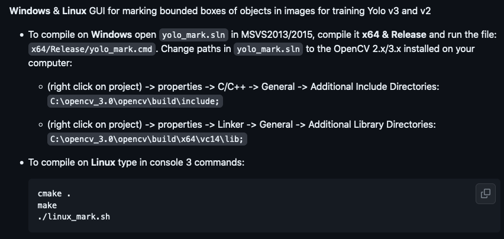
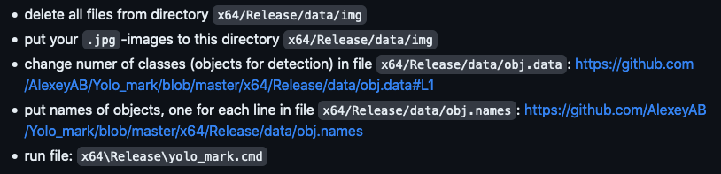
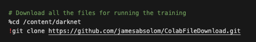

<h1>Instructions:</h1>

<h2>Setup:</h2>

(I'm sorry if these instructions are all over the place or unclear, I'm not great at explaining things and it was 3am when I wrote this)

* Download this repo

* Install python 3.10.9 from <a href="https://www.python.org/downloads/release/python-3109/"> here </a> (I'm not sure if this is the only version that works, but it's the one I used)

<h2>Box Drawing:</h2>
    
In this stage we are going to:
<ol>
    <li> <b> Download a marking software which allows us to draw boxes around what we want to track, this software is called <em>yolo mark</em> </b> </li>
    <li> <b> Compile the software allowing it to work on your machine </b> </li>
    <li> <b> Mark the images we want to track </b> </li>
</ol>

<h3> Step 1 </h3>
<ol>
    <li> As a part of this repo you will get the yolo-mark software installed it will be in a folder called "yolomark" </li>
    <li> We need to compile this software so that your computer can run it </li>
    <li> To do this for windows you need to go to th
</ol>

Follow the instructions to install yolo-mark outlined here 

<h3> Step 2 </h3>

Follow the instructions to mark your images outlined here 

<h2>Darknet Trainer:</h2>

* Go to google colab  and upload the file named <em>Avoro_Darknet_Trainer.ipynb</em> using file > upload notebook
* Follow the instructions and run the cells in the notebook to train your model 
    Notes:
    * The process may overrun the free processing power of google colab, though don't worry as I am happy to train the model using my paid subscription if you send me the images
    * The trainer refers to a github to upload the images to, this is the best solution I could find for this problem, the file format which this trainer uses is a submodule of this repo called "ColabFileDownload". I reccomend making your own repo to hold the images and then changing the trainer to refer to that repo instead of mine. The trainer will have to be changed here:  
    
    * If you have a fast desktop avaliable and have like 4 hours to debug the installation of darknet, you can train the model locally by pretty much running the same commands as in the trainer notebook, though as I said it is a pain to get darknet to train locally for some reason so I reccomend using google colab

<h2>Testing:</h2>

* Once the model is trained, download the weights file, the config file and the names list from the google colab notebook and place it in the testing directory, 
    Notes:
    * The config file can be found in ColabFileDownload then the folder corrisponding to the number of classes you have
    * The names file can be found under <em>/content/darknet/build/darknet/x64/data</em> in the google colab notebook
    * The weights file can be found under <em>content/darknet/results</em> in the google colab notebook (I think?)
* Run the necisary downloads for the testing directory file:  
`pip install opencv-python`  
`pip install numpy`  
* Put an image you want to test into the testing directory and name it <em>test.jpg</em> or change the name in the code
